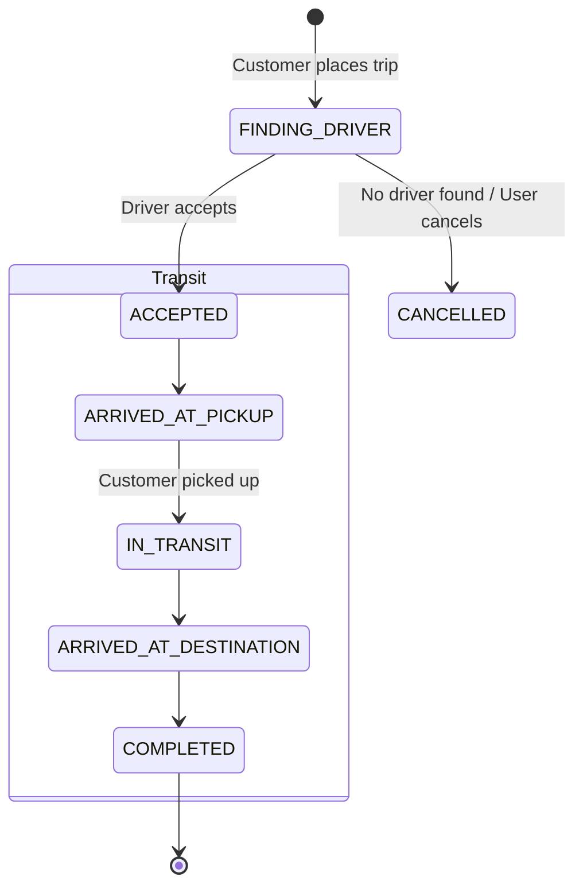

# 🛵 Crab — Open-Source Transport Platform

[](https://opensource.org/licenses/MIT)
[](https://nestjs.com/)
[](https://reactjs.org/)
[](https://postgis.net/)
[](https://socket.io/)
[](https://www.docker.com/)

> **Crab** is a full-stack, open-source transport platform inspired by Grab. Designed to run **100% locally and free** during development with zero paid third-party API dependencies (Google Maps, Mapbox, Twilio).

---

## 📑 Table of Contents
- [Architecture & Tech Stack](#-architecture--tech-stack)
- [Core Features](#-core-features)
- [System Architecture & State Machine](#-system-architecture--state-machine)
- [Geospatial Engine & Algorithms](#-geospatial-engine--algorithms)
- [Project Structure](#-project-structure)
- [Quick Start with Docker](#-quick-start-with-docker)
- [Real-time Events (Socket.io)](#-real-time-events-socketio)
- [Driver Simulation for Dev/Testing](#-driver-simulation-for-devtesting)
- [License](#-license)

---

## 🛠 Architecture & Tech Stack

Crab eliminates paid map and backend APIs by integrating open-source geospatial tools and self-hosted routing services.

| Layer | Technology | Purpose |
|---|---|---|
| **Frontend** | ReactJS + TypeScript + Tailwind CSS | Responsive UI for Customer, Driver, and Admin portals |
| **Mapping & GIS** | Leaflet.js + OpenStreetMap (OSM) | Map rendering, interactive coordinate picking |
| **Routing Engine** | OSRM (Open Source Routing Machine) | Route calculation, distance/duration computation |
| **Interpolation** | Turf.js (`turf.along`, `turf.length`) | Smooth GPS marker movement along routing paths |
| **Backend API** | NestJS (Node.js) + TypeScript | Modular monolith with Clean Architecture / DDD |
| **Real-time Gateway** | Socket.io (WebSockets) | Bi-directional real-time GPS telemetry and notifications |
| **Spatial Database** | PostgreSQL + PostGIS extension | Spatial indexing (`GIST`), coordinate storage (`GEOMETRY`) |
| **Auth & Security** | JWT (Access + Refresh Token) + RBAC | Multi-role access control (`CUSTOMER`, `DRIVER`, `ADMIN`) |
| **Infrastructure** | Docker & Docker Compose | Containerized local environment |

---

## 🌟 Core Features

### 1. 📍 Booking & Dynamic Pricing
- Interactive map-based pickup & dropoff selection via **Leaflet.js**.
- Real-world route calculation via **OSRM API**.
- Dynamic fare calculation formula:
  $$\text{Total Fare} = \text{Base Fare} + (\text{Distance (km)} \times \text{Per-Km Rate}) \times \text{Surge Multiplier (Rain/Peak)}$$

### 2. 🎯 High-Performance Spatial Driver Matching
- PostGIS spatial indexing (`ST_DWithin` + `ST_Distance`) with `GIST` indexes to match available online drivers within radius $R$ in sub-millisecond response times.
- Queue-based & top-$K$ broadcast matching algorithms.

### 3. 🔄 Robust Trip State Machine
- Strict transitions from trip creation to final settlement, preventing race conditions.

### 4. 🛰️ Real-Time GPS Tracking
- High-frequency GPS telemetry streaming via WebSockets.
- Client-side smooth marker animation using **Turf.js along-path interpolation** (1.0s - 1.5s tick interval).

### 5. 🤖 Automated Driver Simulator (Dev/Test Tool)
- Self-running background mock worker that:
  1. Accepts matched trips.
  2. Navigates to pickup point.
  4. Streams realistic GPS coordinates along the actual OSRM path to the destination.

---

## 🔄 System Architecture & State Machine

### Trip Lifecycle State Machine



---

## 📐 Geospatial Engine & Algorithms

### PostGIS Driver Matching Query

Optimized spatial query using `ST_DWithin` (utilizing the GIST spatial index) and `ST_Distance`:

```sql
-- Find top 5 nearest online drivers within a 3km radius (SRID 432F / WGS 84)
SELECT 
    d.id AS driver_id,
    d.full_name,
    d.phone_number,
    ST_Distance(
        d.current_location, 
        ST_SetSRID(ST_MakePoint(:pickupLng, :pickupLat), 4326)::geography
    ) AS distance_meters
FROM drivers d
WHERE 
    d.is_online = true 
    AND d.active_trip_id IS NULL
    AND ST_DWithin(
        d.current_location, 
        ST_SetSRID(ST_MakePoint(:pickupLng, :pickupLat), 4326)::geography, 
        3000 -- 3km radius in meters
    )
ORDER BY distance_meters ASC
LIMIT 5;

```

---

## 📂 Project Structure

```
crab/
├── docker-compose.yml              # PostgreSQL+PostGIS, OSRM, App services
├── .env.example                    # Environment variable templates
├── apps/
│   ├── backend/                    # NestJS API & Gateway
│   │   ├── src/
│   │   │   ├── modules/
│   │   │   │   ├── auth/           # JWT authentication & RBAC
│   │   │   │   ├── trips/         # Trip state machine & lifecycle
│   │   │   │   ├── drivers/        # PostGIS spatial matching
│   │   │   │   ├── tracking/       # Socket.io GPS gateway
│   │   │   │   ├── routing/        # OSRM client service
│   │   │   │   └── simulator/      # Mock driver worker
│   │   │   └── database/           # TypeORM / Prisma migrations
│   │   └── Dockerfile
│   │
│   └── frontend/                   # React SPA
│       ├── src/
│       │   ├── components/map/     # Leaflet map & MovingMarker
│       │   ├── pages/customer/     # Booking & Live Tracking views
│       │   ├── pages/driver/       # Driver dispatch & navigation views
│       │   └── pages/admin/        # Operations & fleet dashboard
│       └── Dockerfile
└── osrm/                           # Local OSRM car profile data (optional)

```

---

## 🚀 Quick Start with Docker

### Prerequisites

* [Docker](https://docs.docker.com/get-docker/) & [Docker Compose](https://docs.docker.com/compose/)
* Node.js >= 20 (for local development outside containers)

### 1. Clone & Configure Environment

```bash
git clone [https://github.com/your-username/crab.git](https://github.com/your-username/crab.git)
cd crab
cp .env.example .env

```

### 2. Start Services with Docker Compose

```bash
# Spins up PostgreSQL+PostGIS, NestJS Backend, and React Frontend
docker-compose up -d --build

```

### 3. Access Applications

* **Customer & Driver Web Client:** `http://localhost:3000`
* **NestJS API & Swagger Docs:** `http://localhost:4000/api/docs`
* **PostgreSQL Database:** `localhost:5432` (`postgres/postgres`)

---

## 📡 Real-time Events (Socket.io)

### Client ⇄ Server Event Contracts

| Event Name | Direction | Payload | Description |
| --- | --- | --- | --- |
| `driver:update_location` | Driver ➔ Server | `{ lat: number, lng: number, heading: number }` | Driver telemetry broadcast |
| `trip:location_stream` | Server ➔ Customer | `{ tripId: string, lat: number, lng: number, heading: number }` | Relays driver position to customer |
| `trip:status_changed` | Server ➔ Both | `{ tripId: string, status: OrderStatus, timestamp: string }` | State machine transition notification |
| `driver:trip_offer` | Server ➔ Driver | `{ tripId: string, pickup: Point, dropoff: Point, fare: number }` | Incoming trip dispatch alert |

---

## 🤖 Driver Simulation for Dev/Testing

To test full end-to-end trip flows without moving physically:

```bash
# Trigger an automated driver run via CLI / API endpoint
curl -X POST http://localhost:4000/api/v1/simulator/simulate-trip \
  -H "Content-Type: application/json" \
  -d '{
    "tripId": "ORD-123456",
    "speedMultiplier": 2.0
  }'

```

The simulator computes the geometry via OSRM, calculates intermediate points at 1-second intervals using `turf.along`, and broadcasts live coordinates to the customer's map view.

---

## 📄 License

Distributed under the **MIT License**. See `LICENSE` for more information.

```

---

<ElicitationsGroup message="Bạn có muốn cấu hình thêm thành phần nào khác cho dự án Crab không?">
  <Elicitation label="Tạo file docker-compose.yml hoàn chỉnh" query="Viết file docker-compose.yml hoàn chỉnh cho Crab bao gồm PostgreSQL PostGIS, NestJS Backend, React Frontend và OSRM container."/>
  <Elicitation label="Code module Driver Simulator (NestJS)" query="Viết code chi tiết cho Driver Simulator Service trong NestJS sử dụng Turf.js để nội suy toạ độ và stream qua Socket.io."/>
  <Elicitation label="Tạo file .env.example chuẩn" query="Tạo danh sách các biến môi trường đầy đủ trong file .env.example cho toàn bộ hệ thống Crab."/>
</ElicitationsGroup>

```
