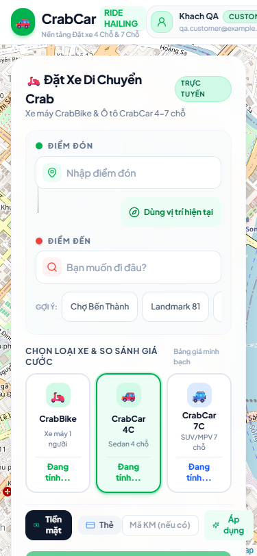
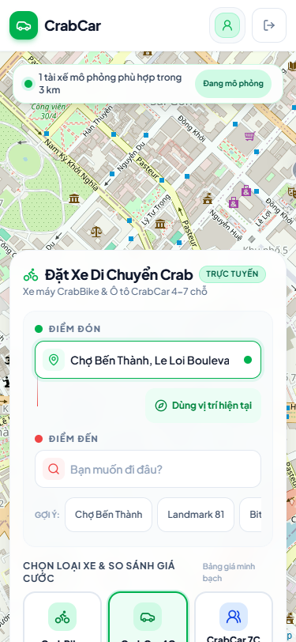
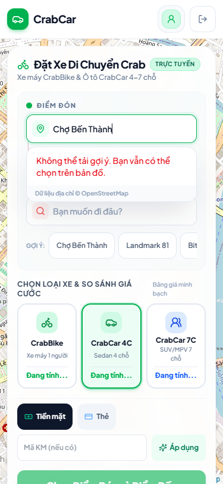
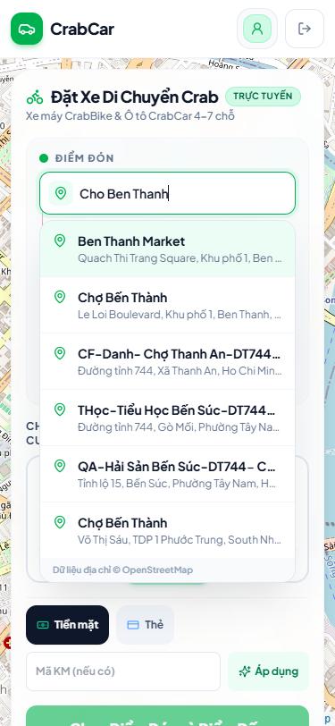

# Dogfood Report: Crab Frontend — Ride Booking

| Field | Value |
|-------|-------|
| **Date** | 2026-08-21 |
| **App URL** | http://127.0.0.1:4173 |
| **Session** | crab-ride-final (`crab-impl` namespace) |
| **Scope** | Nhập điểm đón/đến, autocomplete, mô phỏng tài xế, responsive và accessibility |

## Summary

| Severity | Count |
|----------|-------|
| Critical | 0 |
| High | 0 |
| Medium | 2 |
| Low | 0 |
| **Total** | **2** |

## Issues

### ISSUE-001: Trang đặt xe tràn ngang và che toàn bộ bản đồ trên mobile

| Field | Value |
|-------|-------|
| **Severity** | medium |
| **Category** | visual / ux |
| **URL** | http://127.0.0.1:4173/customer |
| **Status** | Resolved during dogfood |
| **Repro Video** | N/A — lỗi hiển thị tĩnh |

**Description**

Ở viewport 375×812, navbar làm document rộng 465px và panel không có vùng cuộn, khiến nội dung bị cắt và bản đồ gần như không thể quan sát. Đã thu gọn navbar mobile, chặn overflow, thêm vùng cuộn/safe-area và đổi panel thành bottom sheet cao tối đa 68%.

**Evidence**

1. Trước sửa: document 465px trong viewport 375px, panel che map.
   
2. Sau sửa: `scrollWidth === innerWidth === 375`, map/fleet còn hiển thị phía trên bottom sheet.
   

---

### ISSUE-002: Photon trả HTTP 400 nên autocomplete luôn vào error state

| Field | Value |
|-------|-------|
| **Severity** | medium |
| **Category** | functional |
| **URL** | http://127.0.0.1:4173/customer |
| **Status** | Resolved during dogfood |
| **Repro Video** | N/A — trạng thái lỗi và kết quả đã được chụp tĩnh |

**Description**

Frontend gửi `lang=vi`, nhưng public Photon hiện chỉ bật `default`, `de`, `en`, `fr`, nên request trả 400. Đã bỏ tham số không được hỗ trợ để nhận tên địa phương từ dữ liệu OSM; test service khóa hành vi này.

**Evidence**

1. Trước sửa: trường nhập hiển thị “Không thể tải gợi ý”.
   
2. Sau sửa: combobox trả 6 option và hỗ trợ chọn bằng ArrowDown/Enter.
   

---

## Verification Matrix

| Check | Result |
|-------|--------|
| 375×812 | Pass — không tràn ngang, bottom sheet cuộn độc lập |
| 768×1024 | Pass — sidebar/map chia cột, 6 marker |
| 1440×900 | Pass — sidebar/map chia cột, 6 marker |
| 812×375 landscape | Pass — không tràn ngang, sidebar cuộn |
| Chữ lớn 20px trên 375px | Pass — không tràn ngang |
| Autocomplete bàn phím | Pass — listbox/option, ArrowDown/Enter chọn tọa độ |
| Fleet movement | Pass — 6 marker đổi `translate3d` sau 700ms |
| Reduced motion | Pass — 6 marker giữ nguyên sau 700ms |
| Axe WCAG audit | Tool timeout ở cả full page và scoped form; accessibility snapshot thủ công pass các role/label/state chính |
